<!-- Improved compatibility of back to top link: See: https://github.com/othneildrew/Best-README-Template/pull/73 -->
<a name="top"></a>
<!--
*** Thanks for checking out the Best-README-Template. If you have a suggestion
*** that would make this better, please fork the repo and create a pull request
*** or simply open an issue with the tag "enhancement".
*** Don't forget to give the project a star!
*** Thanks again! Now go create something AMAZING! :D
-->


<!-- PROJECT SHIELDS -->
<!--
*** I'm using markdown "reference style" links for readability.
*** Reference links are enclosed in brackets [ ] instead of parentheses ( ).
*** See the bottom of this document for the declaration of the reference variables
*** for contributors-url, forks-url, etc. This is an optional, concise syntax you may use.
*** https://www.markdownguide.org/basic-syntax/#reference-style-links
-->
[![Contributors][contributors-shield]][contributors-url]
[![Forks][forks-shield]][forks-url]
[![Stargazers][stars-shield]][stars-url]
[![Issues][issues-shield]][issues-url]
[![MIT License][license-shield]][license-url]
[![LinkedIn][linkedin-shield]][linkedin-url]


<!-- PROJECT LOGO -->
<br/>
<h3 align="center">Expense Control</h3>

  <p align="center">
    <br/>
    <br />
    <a href="https://bit.ly/expense-control">View Demo</a>
    ·
    <a href="https://github.com/HeitorLouzeiro/django-expense-control/issues">Report Bug</a>
    ·
    <a href="https://github.com/HeitorLouzeiro/django-expense-control/issues">Request Feature</a>
  </p>
</div>


<!-- TABLE OF CONTENTS -->
<details>
  <summary>Table of Contents</summary>
  <ol>
    <li>
      <a href="#about-the-project">About The Project</a>
      <ul>
        <li><a href="#built-with">Built With</a></li>
      </ul>
    </li>
    <li><a href="#usage">Usage</a></li>
    <li>
      <a href="#getting-started">Getting Started</a>
      <ul>
        <li><a href="#prerequisites">Prerequisites</a></li>
        <li><a href="#installation">Installation</a></li>
      </ul>
    </li>
    <li><a href="#roadmap">Roadmap</a></li>
    <li><a href="#contributing">Contributing</a></li>
    <li><a href="#collaborators">Collaborators</a></li>
    <li><a href="#license">License</a></li>
    <li><a href="#contact">Contact</a></li>
    <li><a href="#acknowledgments">Acknowledgments</a></li>
  </ol>
</details>


<!-- ABOUT THE PROJECT -->
## About The Project

This project was created to improve my knowledge in Django, html, css, boostrap, javaScript and added another ability to show results in graphs with chartjs, in addition to training different ways of working with django, where I overcame the difficulties of using chartjs and I worked on new ways of working with django using Django's Views classes, along with JavaScript validation, importing data from a json file and saving it in the database, exporting data to CSV and Excel files, with account activation and password recovery via email.

* [Expense-control](https://bit.ly/expense-control)

<p align="right">(<a href="#top">back to top</a>)</p>


### Built With

* [![Python][Python]][Python-url]
* [![Django][Django]][Django-url]
* [![JavaScript]][JavaScript-url]
* [![SQLite][SQLite]][SQLite]
* [![Bootstrap][Bootstrap.com]][Bootstrap-url]
* [![HTML][HTML]][HTML-url]
* [![CSS][CSS]][CSS-url]

<p align="right">(<a href="#top">back to top</a>)</p>

<!-- USAGE EXAMPLES -->
## Usage
### 1.User Login Page.
<p align="center">
      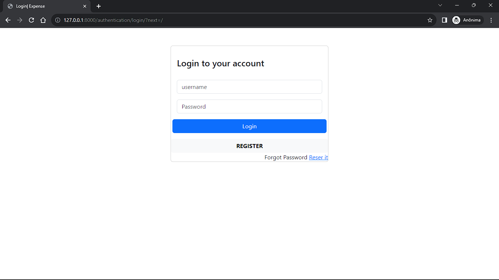
    <br/>
</p>

### 2.Register Page.
<p align="center">
      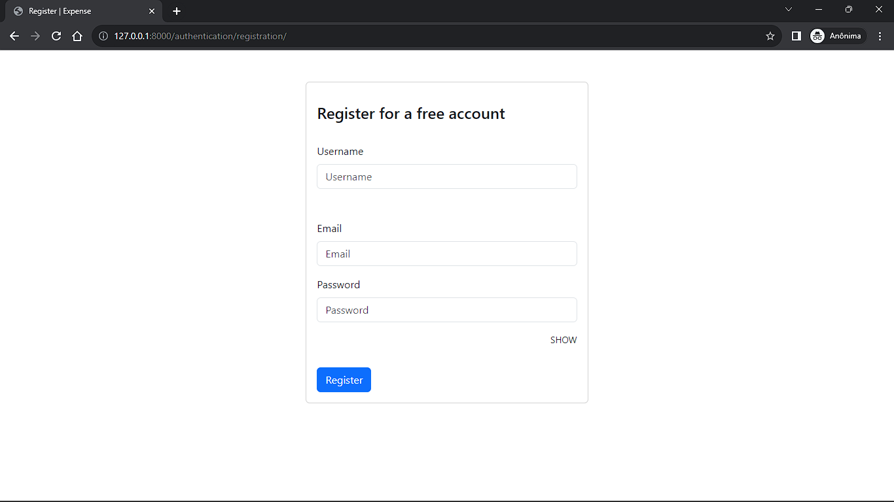
    <br/>
</p>

### 3.Reset Password Page.
<p align="center">
      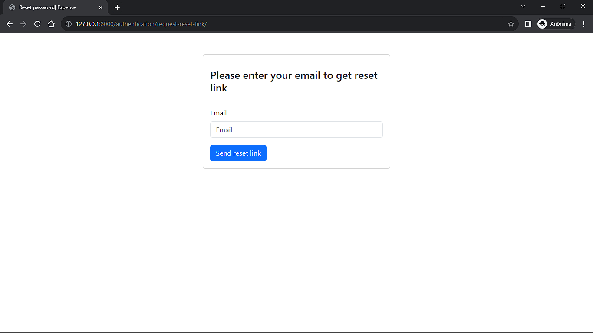
    <br/>
</p>

  ### 4.Home Page. 
<p align="center">
    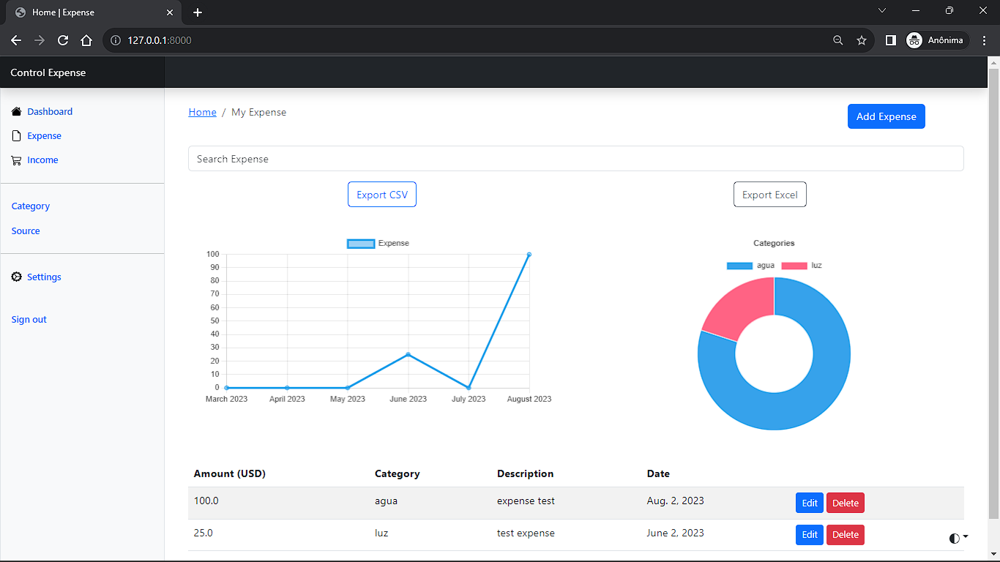
    <br/>
</p>

  ### * Dark Mode.
  <p align="center">
    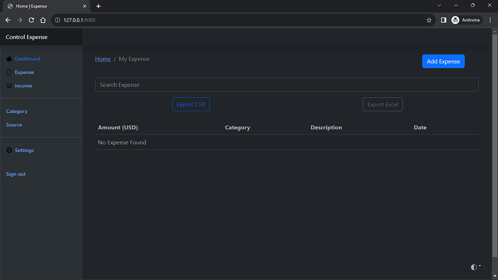
    <br/>
</p>


  ### 5.Create Expense Data.
<p align="center">
    
    <br/>
</p>

  ### 6.Edit Expense Data. 
<p align="center">
    
    <br/>
</p>

  ### 7.Search data. 
<p align="center">
    
    <br/>
</p>

  ### 8.View Category data. 
<p align="center">
    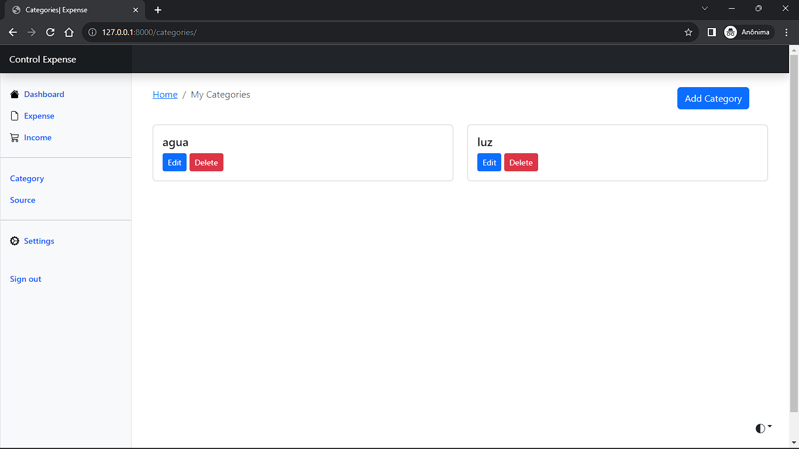
    <br/>
</p>

  ### 9.Create Category data. 
<p align="center">
    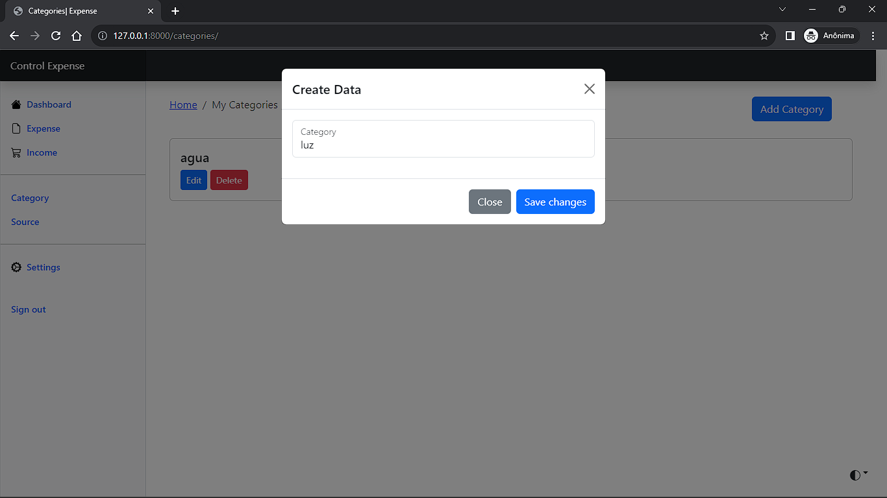
    <br/>
</p>

  ### 10.Edit Category data. 
<p align="center">
    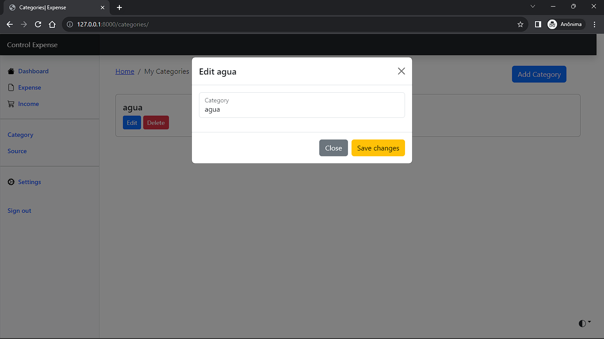
    <br/>
</p>

  ### 11.Delete Category data. 
<p align="center">
    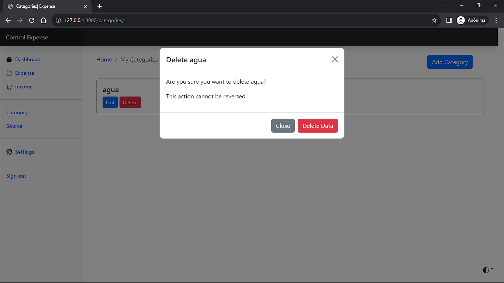
    <br/>
</p>

  ### 12.View Income Data.
<p align="center">
    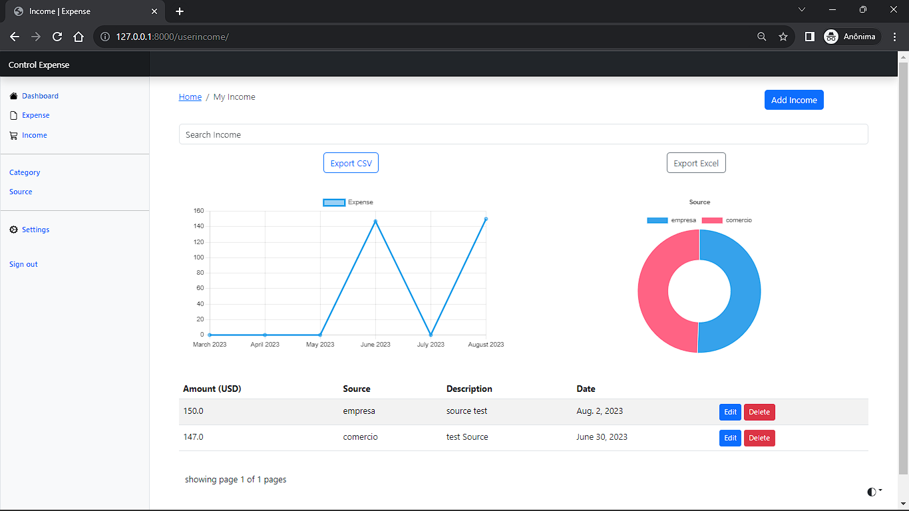
    <br/>
</p>

  ### 13.Create Income Data. 
<p align="center">
    
    <br/>
</p>

  ### 14.Edit Income Data. 
<p align="center">
    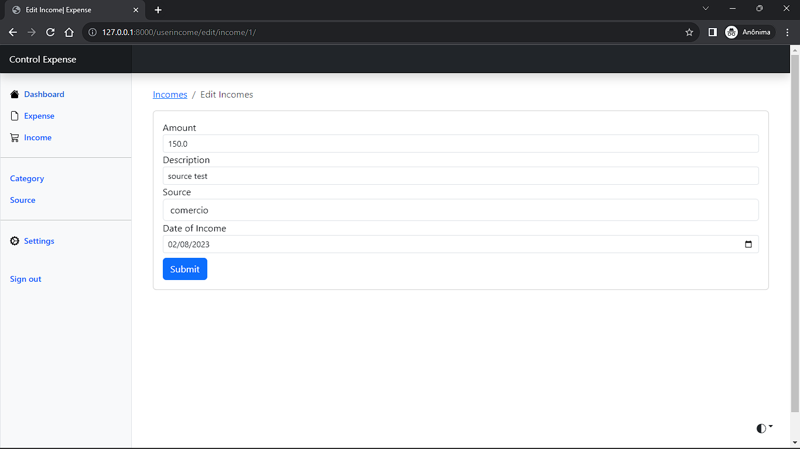
    <br/>
</p>

  ### 15.View Source data. 
<p align="center">
    
    <br/>
</p>

  ### 16.Create Source data. 
<p align="center">
    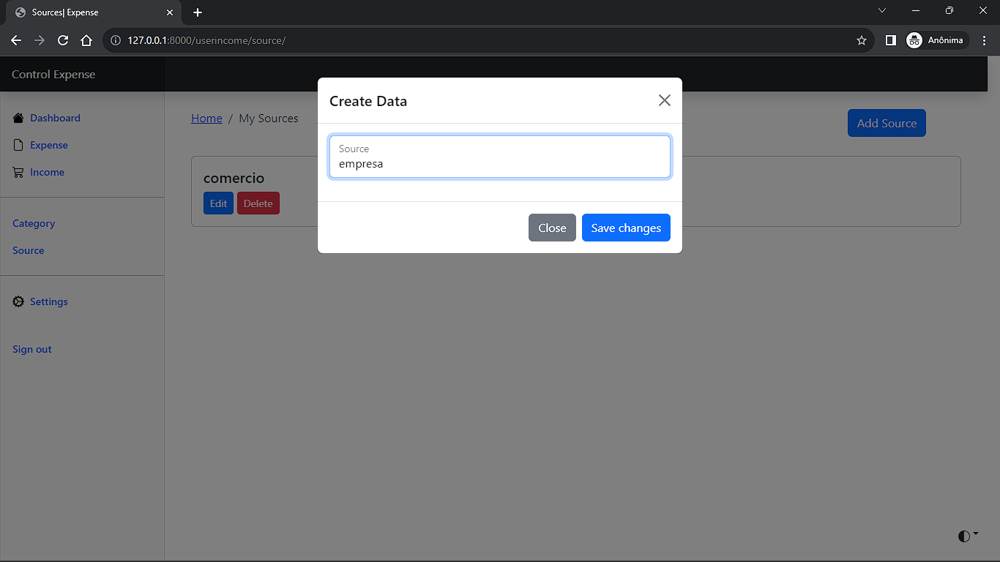
    <br/>
</p>

  ### 17.Edit Source data. 
<p align="center">
    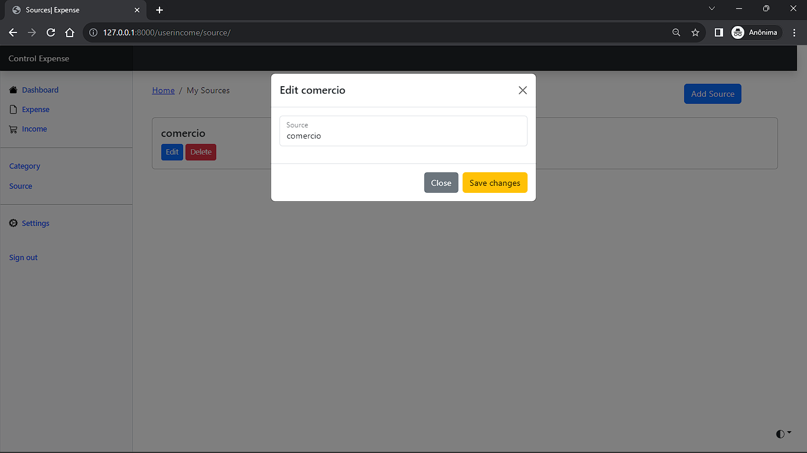
    <br/>
</p>

  ### 18.Delete Source data. 
<p align="center">
    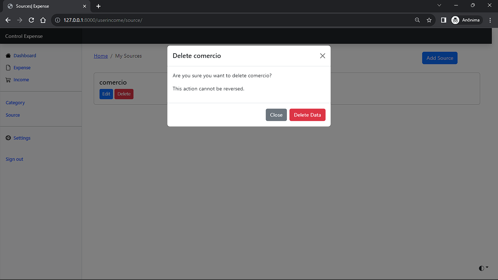
    <br/>
</p>

  ### 19.Preferred Currency. 
<p align="center">
    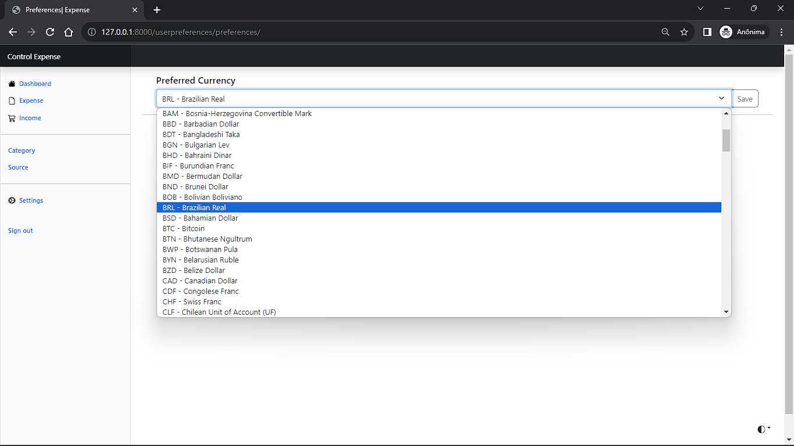
    <br/>
</p>


  ### 20.Export CSV. 
<p align="center">
    
    <br/>
</p>

  ### 21.Export Excel. 
<p align="center">
    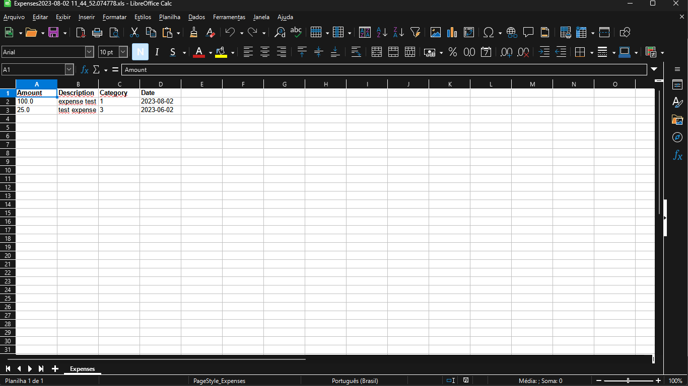
    <br/>
</p>

<p align="right">(<a href="#top">back to top</a>)</p>

### Prerequisites

* [Python](https://www.python.org/)

<!-- GETTING STARTED -->
## Getting Started
### Installation

1. Clone the repo
   ```sh
   git clone https://github.com/HeitorLouzeiro/django-expense-control.git
   ```
2. Access the project folder in terminal/cmd
   ```sh
   cd django-expense-control
   ```
3. Create a virtualenv with Python 3.9.0.
   ```sh
   python -m venv venv
   ```
4. Activate virtualenv.
    * Ubunto
    ```sh
    source venv/bin/activate
    ```

    * MacOs
    ```sh
    source venv/bin/activate
    ```

    * Windows 
    ```sh
     venv\scripts\activate
    ```

5. Install as dependencies.
    ```sh
     pip install -r requirements.txt
    ```

6. Configure an instance with .env.
    ```sh
     cp .env-example .env
    ```
    or

    Copy the env-example to a new file called .env and then open it and change the variable values ​​if necessary

   
7.  Change the .env variables, put your email and gmail password, if you have two-factor security follow the tutorial below.
   * [Support Google](https://support.google.com/accounts/answer/185833?hl=pt-BR)
    
8. Run the migrations.
    ```sh
     python manage.py migrate
    ```

9.  Create a Superuser.
    ```sh
     python manage.py createsuperuser
    ``` 
    
10. Run the application.
    ```sh
     python manage.py runserver
    ```   

<p align="right">(<a href="#top">back to top</a>)</p>


<!-- ROADMAP -->
## Roadmap
  - [x] User Login Page.
  - [x] User Register Page.
  - [x] Active User Verification.
  - [x] Reset Password Page.
  - [x] Home Page.
  - [x] Create Expense Data.
  - [x] Create Expense Data.
  - [x] Edit Expense Data. 
  - [x] Delete Expense Data.
  - [x] Search Expense data.
  - [x] View Category data.
  - [x] Create Category data.
  - [x] Edit Category data.
  - [x] Delete Category data.
  - [x] View Income Data.
  - [x] Create Income Data. 
  - [x] Edit Income Data.
  - [x] Delete Income Data.
  - [x] View Source data. 
  - [x] Create Source data.
  - [x] Edit Source data.
  - [x] Delete Source data.
  - [x] Search Income data.
  - [x] Export CSV.
  - [x] Export Excel. 
  - [x] Preferred Currency.
  - [x] Dark Mode.


 


See the [open issues](https://github.com/HeitorLouzeiro/django-expense-control/issues) for a full list of proposed features (and known issues).

<p align="right">(<a href="#top">back to top</a>)</p>

<!-- CONTRIBUTING -->
## Contributing

Contributions are what make the open source community such an amazing place to learn, inspire, and create. Any contributions you make are **greatly appreciated**.

If you have a suggestion that would make this better, please fork the repo and create a pull request. You can also simply open an issue with the tag "enhancement".
Don't forget to give the project a star! Thanks again!

1. Fork the Project
2. Create your Feature Branch (`git checkout -b feature/Improvements`)
3. Commit your Changes (`git commit -m 'Add my new Enhancements'`)
4. Push to the Branch (`git push origin feature/Improvements`)
5. Open a Pull Request

<p align="right">(<a href="#top">back to top</a>)</p>

## Collaborators

We thank the following people who contributed to this project:

<table>
  <tr>
    <td align="center">
      <a href="#">
        <br>
        <sub>
          <b>Heitor Louzeiro</b>
        </sub>
      </a>      
    </td>
  </tr>
</table>

<p align="right">(<a href="#top">back to top</a>)</p>


<!-- LICENSE -->
## License

Distributed under the MIT License. See [LICENSE](LICENSE) for more information.

<p align="right">(<a href="#top">back to top</a>)</p>


<!-- CONTACT -->
## Contact

<div align='center'>  
  <a href="https://www.instagram.com/heitorlouzeiro/" target="_blank">
    
  </a> 
  <a href = "mailto:heitorlouzeirodev@gmail.com">
        
  </a>
  <a href="https://www.linkedin.com/in/heitor-louzeiro/" target="_blank">
    
  </a> 
</div>

Project Link: [https://github.com/HeitorLouzeiro/django-expense-control](https://github.com/HeitorLouzeiro/django-expense-control)

<p align="right">(<a href="#top">back to top</a>)</p>


<!-- MARKDOWN LINKS & IMAGES -->
<!-- https://www.markdownguide.org/basic-syntax/#reference-style-links -->
[contributors-shield]: https://img.shields.io/github/contributors/HeitorLouzeiro/django-expense-control.svg?style=for-the-badge
[contributors-url]: https://github.com/HeitorLouzeiro/django-expense-control/graphs/contributors
[forks-shield]: https://img.shields.io/github/forks/HeitorLouzeiro/django-expense-control.svg?style=for-the-badge
[forks-url]: https://github.com/HeitorLouzeiro/django-expense-control/network/members
[stars-shield]: https://img.shields.io/github/stars/HeitorLouzeiro/django-expense-control.svg?style=for-the-badge
[stars-url]: https://github.com/HeitorLouzeiro/django-expense-control/stargazers
[issues-shield]: https://img.shields.io/github/issues/HeitorLouzeiro/django-expense-control.svg?style=for-the-badge
[issues-url]: https://github.com/HeitorLouzeiro/django-expense-control/issues
[license-shield]: https://img.shields.io/github/license/HeitorLouzeiro/django-expense-control.svg?style=for-the-badge
[license-url]: https://github.com/HeitorLouzeiro/django-expense-control/blob/master/LICENSE
[linkedin-shield]: https://img.shields.io/badge/-LinkedIn-black.svg?style=for-the-badge&logo=linkedin&colorB=555
[linkedin-url]: https://linkedin.com/in/heitor-louzeiro

[Python]: https://img.shields.io/badge/Python-14354C?style=for-the-badge&logo=python&logoColor=white
[Python-url]: https://www.python.org/

[Django]: https://img.shields.io/badge/Django-092E20?style=for-the-badge&logo=django&logoColor=white
[Django-url]: https://www.djangoproject.com/


[SQLite]: https://img.shields.io/badge/SQLite-07405E?style=for-the-badge&logo=sqlite&logoColor=white
[SQLite-url]: https://www.sqlite.org/index.html

[Bootstrap.com]: https://img.shields.io/badge/Bootstrap-563D7C?style=for-the-badge&logo=bootstrap&logoColor=white
[Bootstrap-url]: https://getbootstrap.com

[HTML]:https://img.shields.io/badge/HTML5-E34F26?style=for-the-badge&logo=html5&logoColor=white
[HTML-url]: https://github.com/HeitorLouzeiro/django-expense-control/#

[CSS]: 	https://img.shields.io/badge/CSS-239120?&style=for-the-badge&logo=css3&logoColor=white
[CSS-url]: https://github.com/HeitorLouzeiro/django-expense-control/#

[JavaScript]: https://img.shields.io/badge/JavaScript-F7DF1E?style=for-the-badge&logo=javascript&logoColor=black
[JavaScript-url]: https://github.com/HeitorLouzeiro/django-expense-control/#


